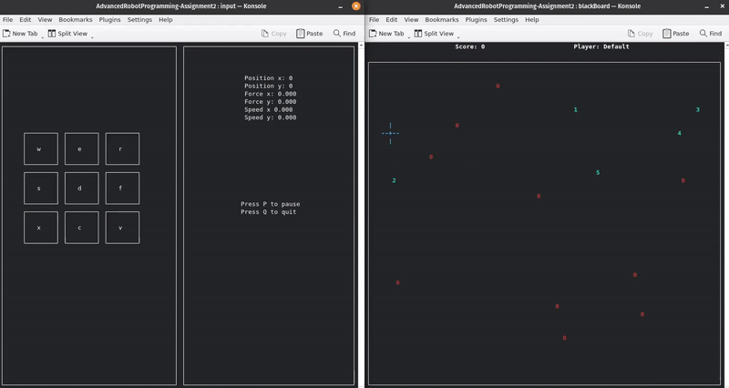
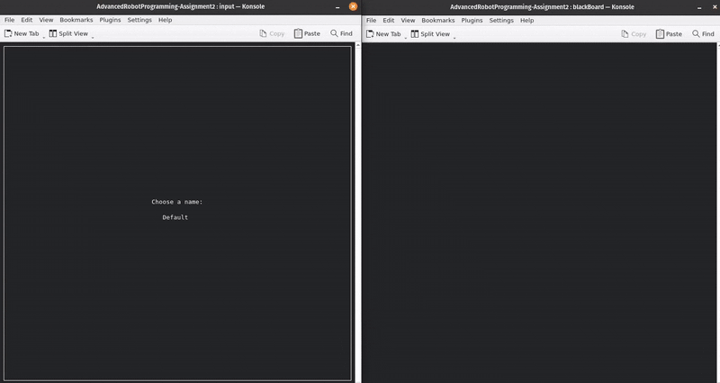

# Advanced Robot Programming - Assignment 2

## Project Overview
This repository contains the implementation for the second assignment of the Advanced Robot Programming class. The project replicates the behavior of the first assignment but utilizes Fast DDS (Data Distribution Service) for communication. This enables the program to run on two separate computers:

- One computer generates the target and obstacles, publishing them on two topic.
- The second computer, where the blackboard subscribes to the topics, allows the drone to be controlled via keyboard input, moving in the environment with the obstacles and target.



## Installation Instructions and Requirements
To set up the project, follow these steps:
1. Clone the repository: ```git@github.com:MattiaTinfena/AdvancedRobotProgramming-Assignment2.git```
2. Make the installation script executable: ```chmod +x install.sh ```
3. Run the script: ```./install.sh```

The ```install.sh``` script automates the installation of required dependencies for the project and performs the following actions:

1. Updates the package lists and upgrades installed packages.
2. Installs necessary terminal emulators (Terminator and Konsole).
3. Installs development libraries for ncurses and cJSON.
4. Downloads and installs the Fast DDS library from eProsima.
5. Cleans up previous build files and compiles the project.

## Usage and recompilation
After installation, you can run the project using one of the following methods:

- Direct execution:  ```./bin/main```
- Using the vscode environment with the launch.json file provided in the .vscode folder.

If some changes are made to the code, it is necessary to run the make command to recompile the project before running it. Otherwise, you can use the "Run Code" if you are using vscode.

However, when compiling with VS Code, some issues cause the window to resize incorrectly. To resolve this, it is advisable to run ```make clean``` followed by ```make``` from terminal.

## Project Architecture
The project architecture of the assignement includes 6 active components, a parameter file ("appsettings.json"), and a log folder ("log") for all log file.


### Blackboard
As in the first assignment, the blackboard serves as a central component that stores the state of the environment and communicates with other system components. It interacts with the obstacle and target publisher using Fast DDS subscribers, receiving data via "topic1" and "topic2" respectively.

The blackboard displays a real-time map of the environment, showing the drone, targets, and obstacles.

The primitives of the blackboard are the following:
- File Manipulation: Functions like fopen(), fwrite(), and fclose() are used to open a log file, write messages, and close it.
- flock() used in the function writeSecure() manages file locking:
    - LOCK_EX for exclusive write access.
    - LOCK_SH for shared read access.
    - LOCK_UN to unlock the file.
- Process Management and Signal Handling:
    - getpid(), which retrieves the process ID.
    - sigaction() handles signals from the watchdog (SIGUSR1), manages termination cleanup (SIGTERM), and detects window resizing (SIGWINCH).
    - kill(): used to send a signal.
    - sigset_t mask ensures safe signal handling with pselect().
- Interprocess Communication (IPC) via Pipes:
    - write() and read() facilitate data exchange between processes in writeMsg(), writeInputMsg(), readMsg() and readInputMsg().
- UI Handling with Ncurses:
    - initscr(), start_color(), curs_set(), noecho(), cbreak() configure input and display settings.
    - getmaxyx() retrieves terminal size for dynamic UI.
    - newwin(), box(), wrefresh(), mvwprintw(), and werase() manage windows and content rendering.
- Configuration & JSON Parsing:
    - cJSON_Parse(), cJSON_GetObjectItemCaseSensitive(), cJSON_Print(), and cJSON_Delete() handle reading, modifying, and freeing configuration data.

readMsg() and writeMsg() facilitate IPC via pipes by reading and writing a Message structure, logging errors, and terminating on failure. readInputMsg() and writeInputMsg() do the same but with an inputMessage structure.

The TargetSubscriber and ObstacleSubscriber classes handle the communication with the target and obstacle publishers, respectively, using Fast DDS subscribers. Once a successful connection is established, they start to receive data from the publishers and update the blackboard accordingly. The FastDDS Communication primitives are:
- Partecipant Management
    - get_instance() to get the domain participant factory.
    - create_participant() to create a participant and delete_participant() to clean it up
- Topic Management
    - create_topic() defines a DDS topic for publishing, and delete_topic() removes it.
    - register_type(participant_) registers the data type.
- Subscriber Management
    - create_subscriber() creates a subscriber and delete_subscriber() deletes it.
    - create_datareader() creates a DataReader to receive messages and delete_datareader() to clean it up.
    - take_next_sample() reads messages when data is available.
- Interprocess Communication (IPC) Primitives
    - ```server_qos.wire_protocol().builtin.discovery_config.discoveryProtocol = DiscoveryProtocol::SERVER``` configures the subscriber as a server to handle discovery.
    - Network configuration
        - IPLocator::setIPv4() sets the IP address for communication.
        - locator.port defines the port number.
        - server_qos.wire_protocol().builtin.metatrafficUnicastLocatorList.push_back(locator) adds a unicast locator for meta-traffic.
    - ```server_qos.wire_protocol().builtin.discovery_config.m_DiscoveryServers.push_back(remote_locator)``` adds a remote discovery server.


### Target and obstacle
The target and obstacle processes operate similarly, generating random positions within the environment and sending them to the blackboard for display and processing. Each process publishes its respective data to the blackboard using Fast DDS. However, since Target and Obstalce do not have a direct communication channel, some targets may overlap with obstacles.

The target and obstacle utilize the following primitives:
- File Manipulation: Functions like fopen(), fwrite(), and fclose() are used to open a log file, write messages, and close it.
- flock() used in the function writePid() manages file locking:
    - LOCK_EX for exclusive write access.
    - LOCK_SH for shared read access.
    - LOCK_UN to unlock the file.
- Process Management and Signal Handling:
    - writePid(), which retrieves the process ID using getpid().
    - sigaction() handles signals from the watchdog (SIGUSR1), manages termination cleanup (SIGTERM).
- Configuration & JSON Parsing:
    - cJSON_Parse(), cJSON_GetObjectItemCaseSensitive(), cJSON_Print(), and cJSON_Delete() handle reading, modifying, and freeing configuration data.

The TargetPublisher and ObstaclePublisher classes manage communication with the blackboard’s subscriber. Once a successful connection is established, they publish the generated data. The FastDDS communication primitives are:
- Partecipant Management
    - get_instance() to get the domain participant factory. 
    - create_participant() to create a participant and delete_participant() to clean it up.

- Topic Management
    - create_topic() defines a DDS topic for publishing, and delete_topic() removes it.
    - register_type(participant_) registers the data type.
- Publisher Management
    - create_publisher() initializes a publisher instance, and delete_publisher() cleans it up.
    - create_datawriter() creates a DataWriter to send messages, while delete_datawriter() removes it.
    - write() pubblishes messages on the topic.

- Interprocess Communication (IPC) Primitives
    - ```client_qos.wire_protocol().builtin.discovery_config.discoveryProtocol = DiscoveryProtocol::CLIENT``` configures Client-Server Discovery for DDS.
    - ```client_qos.wire_protocol().builtin.discovery_config.m_DiscoveryServers.push_back(locator)``` adds the server’s locator.
    - Network Configuration:
        - IPLocator::setIPv4() sets the IP address for communication.
        - locator.port defines the port number.


### Watchdog
The watchdog continuously monitors system activity, detecting inactivity and triggering alerts when no response occur. To do so, it periodically sends a SIGUSR1 signal to all monitored processes to verify their responsiveness. If a process fails to respond, the watchdog logs the issue and terminates the all the processes under its control with SIGTERM.


The watchdog utilizes the following primitives:
- File Manipulation: Functions like fopen(), fwrite(), and fclose() are used to open a log file, write messages, and close it.
- Process Management and Signal Handling:
    - sigaction() manages the watchdog functionability using SIGUSR1,
    - kill(): used to send a signal
    - getpid(): used to get the process ID of the watchdog and write it on the passParam file.
    - Sigaction(): used to initialize the signal handler to handle the signal sent by the watchdog.

In particular, writeSecure() and readSecure() are custom functions designed for safe file operations. writeSecure() allows for writing while ensuring that no two processes modify it simultaneously. Meanwhile, readSecure() reads a specific line while maintaining safe concurrent access.

#### Passparam file
The passparam file is used from the various process to write their process id so that the watchdog is able to read them and send them a signal to check if they are still running.

### Input
The input handles user input and displays relevant information using the ncurses library, including the drone's position and speed and the forces acting on the drone.

Upon startup, the user selects: the player's name and a key configuration between the default one and a custom one. In this last one, the eight external keys allow to move the drone by adding a force in the respective direction. On the other hand, the central key is used to instantly zero all the forces, in order to see the inertia on the drone.



In addition, they can choose to pause the game at any time by pressing the 'p' key, or to quit the game by pressing the 'q' key. Other keys pressed are ignored.

The input utilizes the following primitives:

- File Manipulation: fopen(), fwrite(), and fclose() to open, write, and close log files.
- flock() used in the function writeSecure() manages file locking:
    - LOCK_EX for exclusive write access.
    - LOCK_SH for shared read access.
    - LOCK_UN to unlock the file.
- Process Management & Signal Handling:
    - getpid(), which retrieves the process ID.
    - sigaction() handles signals from the watchdog (SIGUSR1), manages termination cleanup (SIGTERM), and detects window resizing (SIGWINCH).
- Interprocess Communication (IPC) via Pipes: write() and read() facilitate data exchange between processes in writeInputMsg() and readInputMsg().
- UI Handling with Ncurses:
    - initscr(), start_color(), curs_set(), noecho(), cbreak(), and nodelay() configure input and display settings.
    - getmaxyx() retrieves terminal size for dynamic UI.
    - newwin(), box(), wrefresh(), mvwprintw(), and werase() manage windows and content rendering.
- Configuration & JSON Parsing:
    - cJSON_Parse(), cJSON_GetObjectItemCaseSensitive(), cJSON_Print(), and cJSON_Delete() handle reading, modifying, and freeing configuration data.

In particular, writeSecure() ensure safe file operations, while preventing concurrent writes.

### Drone
The drone handles movement and interaction with targets and obstacles, using force-based navigation. The formula used to calculate the next position of the drone is the following:

$$ x_i = \frac {2m\cdot x_{i-1} + Tk \cdot x_{i-1} + F_x \cdot T^2 - m \cdot x_{i-2}}{m + Tk} $$

where:
- $m$ is the drone's mass
- $x_{i - 1}$ and $x_{i-2}$ are the drone's position respectivelly at istance $i-1$ and istance $i-2$
- $T$ is the period
- $k$ is the viscous costant
- $F_x$ is the sum of all the forces in that given direction

For the y coordinate the formula is the same. Analyzing how the total force acting on the drone was calculated, this is given by:
- User input, where each key pressed adjusts the force vector by increasing the corresponding force applied to the drone.
- Repulsive force from the obstacles;

$$ F_{rep} = \begin{cases} \eta \cdot \left(\frac{1}{\rho(q)} - \frac{1}{\rho_0} \right) \frac{1}{\rho^2(q)}\nabla\rho(q), & \text{if } \rho(q) \leq \rho_0\\  0, & \text{if} \rho(q) > \rho_0 \end{cases} $$

where $\eta$ is is a positive scaling factor, $\rho$ is the distance between the single obstacle and the drone and $\rho_0$ is the threshold above which the obstacle has no influence.
- Attractive force from the targets.

$$ F_{att} = - \psi \frac{(q - q_{goal})}{||q-q_{goal}||} $$

where $\psi$ is a positive scaling factor, $q_{goal}$ is the target position and $q$ is the drone position. 

The drone utilizes the following primitives:
- File Manipulation: Functions like fopen(), fwrite(), and fclose() are used to open a log file, write messages, and close it.
- flock() used in the function writePid() manages file locking:
    - LOCK_EX for exclusive write access.
    - LOCK_SH for shared read access.
    - LOCK_UN to unlock the file.
- Process Management and Signal Handling:
    - writePid(), which retrieves the process ID using getpid().
    - Sigaction() used to initialize the signal handler to handle the signal sent by the watchdog
- Interprocess Communication (IPC) via Pipes:
    - write() and read() facilitate data exchange between processes in writeMsg() and readMsg().
- Configuration & JSON Parsing:
    - cJSON_Parse(), cJSON_GetObjectItemCaseSensitive(), cJSON_Print(), and cJSON_Delete() handle reading, modifying, and freeing configuration data.

In particular, writeSecure() ensure safe file operations, allowing to modify a specific line while preventing concurrent writes. Lastly, readMsg() and writeMsg() facilitate IPC via pipes by reading and writing a Message structure, logging errors, and terminating on failure.

## Parameter management
All configurable parameters are stored in the appsettings.json file and can be modified. These parameters include:
- Player Settings: the default player name and default key bindings, which can be customized at the start of the game;
- Environment Settings: Number of targets and obstacles, determining the density of entities in each level;
- Physics Parameters: Defines drone dynamics, such as force limits, mass, and movement precision.
- Network Configuration: Specifies IP addresses and ports for communication between the server and client components.

## Logging
Logs are available to assist developers in debugging the project and to provide users with insights into the execution process. Each component generates its own log file, storing relevant information, all of which are located in the logs folder. The level of detail in the logs varies based on the project's build mode. In debug mode, more detailed information is recorded, while in release mode, logging is minimized. This behavior is controlled by the USE_DEBUG flag and developed using MACROS.